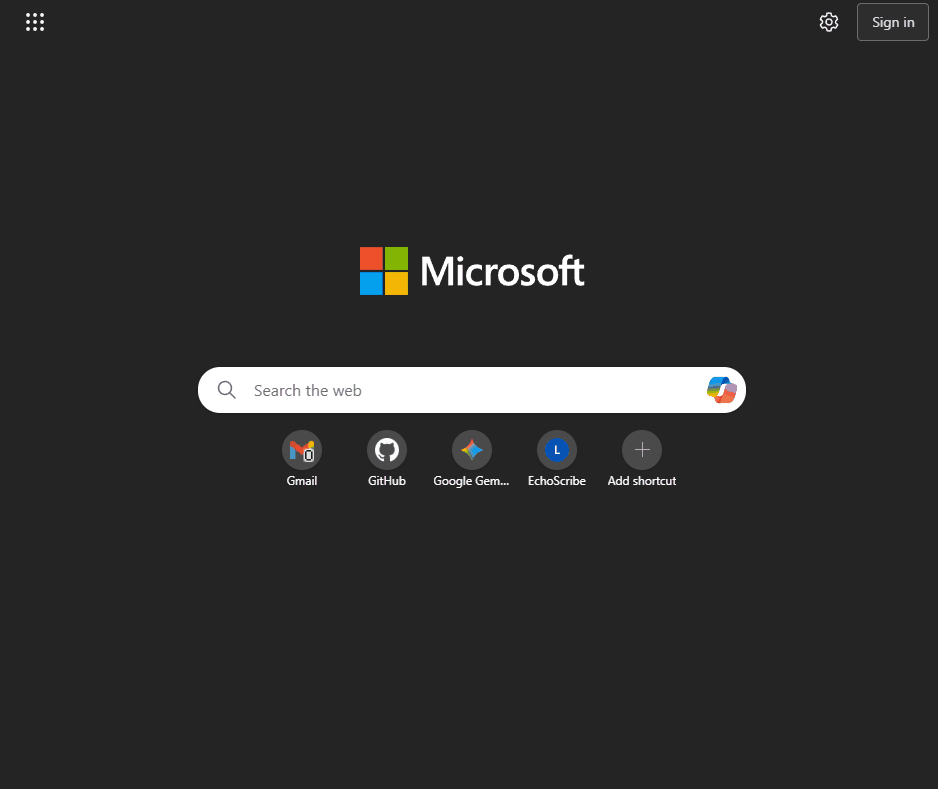
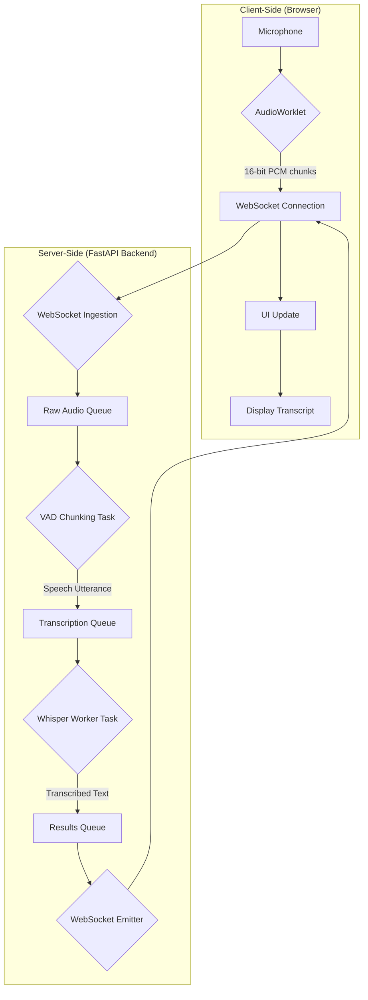
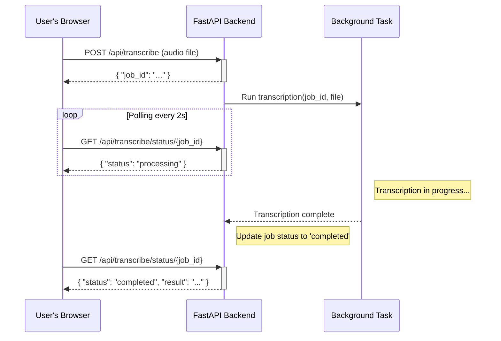

# EchoScribe

[]()
[](/LICENSE)

EchoScribe is a high-performance, self-hosted web application for both **real-time** and **batch** audio transcription. It leverages the power of `Faster-Whisper`, Silero VAD, and a modern web stack to provide a fast, accurate, and private transcription solution.

The interface allows you to select different Whisper models, choose your compute device (CPU or CUDA-enabled GPU), and fine-tune VAD parameters for optimal performance.

## Demo
Here’s a quick look at how to use EchoScribe's real-time and batch transcription features.



## ✨ Features

-   **🎙️ Real-time Transcription:** Speak into your microphone and see the transcription appear live.
-   **📂 Batch Processing:** Upload audio files and get the full transcription in the sidebar.
-   **🚀 High Performance:** Uses `faster-whisper` for optimized CTranslate2-based inference.
-   **🗣️ Voice Activity Detection (VAD):** Smartly chunks audio using Silero VAD to transcribe only when speech is detected, improving accuracy and reducing processing.
-   **⚙️ Configurable:**
    -   Choose from various Whisper models (from `tiny` to `large-v3`).
    -   Select compute device (`CPU` or `CUDA`).
    -   Adjust VAD parameters like silence duration and speech probability threshold.
-   **💾 Download Recordings:** After a real-time session, download your recording as an MP3 file.
-   **📝 Export Transcripts:** Easily copy the transcript or download it as a `.txt` file.
-   **🌐 Modern UI:** Clean and intuitive interface built with Tailwind CSS.

## ⚙️ How It Works

EchoScribe's architecture is designed for low-latency real-time processing. It uses a multi-stage, asynchronous pipeline on the backend.

### Real-time Transcription Flow

The real-time transcription process involves a continuous flow of data from the client's microphone to the server, through a processing pipeline, and back to the client's screen.



- **Client (Browser)**: The AudioWorklet captures audio from the microphone, downsamples it to 16kHz, and converts it to 16-bit PCM audio chunks.

- **WebSocket Connection**: These raw audio chunks are sent to the backend over a persistent WebSocket connection.

- **Backend Pipeline**:
    1. **Ingestion**: The server receives the audio chunks and places them into a raw audio queue.
    2. **VAD Chunking**: A dedicated task pulls from this queue and uses the Silero VAD model to detect speech. It buffers audio until it detects a pause (end of an utterance).
    3. **Transcription**: Once a complete utterance is buffered, it's sent to the transcription queue. A worker task picks it up and transcribes it using the selected faster-whisper model.
    4. **Emitter**: The resulting text is placed in a results queue. Another task sends this text back to the client over the same WebSocket.
    5. **UI Update**: The client receives the transcribed text and updates the user interface in real-time.

### Batch Transcription API Flow

The batch transcription process offloads the work to a background task, allowing you to upload large files without blocking the server. You can poll the status of the job to get the result when it's ready.



### API Endpoints
The application exposes several RESTful and WebSocket endpoints to power the frontend.
| Method | Path | Description |
| :--- | :--- | :--- |
| `GET` | `/` | Serves the main HTML frontend. |
| `GET` | `/api/config` | Provides available models, compute devices, and languages to the client. |
| `GET` | `/api/settings` | Retrieves the current VAD and application settings from `config.yaml`. |
| `POST` | `/api/settings` | Updates and saves new settings to `config.yaml`. |
| `POST` | `/api/transcribe` | Uploads an audio file for batch transcription. Returns a `job_id`. |
| `GET` | `/api/transcribe/status/{job_id}` | Polls the status and result of a batch transcription job. |
| `WEBSOCKET` | `/ws/{session_id}` | Establishes the real-time transcription WebSocket connection. |
| `GET` | `/download/{session_id}` | Downloads the complete audio recording of a real-time session as an MP3. |

## 🛠️ Getting Started
### ⚠️ Important Compatibility Note
**Apple Silicon (M1/M2/M3) is NOT supported for GPU acceleration**.

The underlying library `CTranslate2` used by `faster-whisper` does not currently have optimized support for Apple's MPS backend. Attempting to use the `mps` device will result in errors/poor performance. Mac users should select the `cpu` device.

### Prerequisites
- **Python**: Version 3.9+ is recommended.
- **Git**: To clone the repository.
- **FFmpeg**: This is a system dependency and must be installed separately.
    - **Ubuntu/Debian**: `sudo apt update && sudo apt install ffmpeg`
    - **macOS (with Homebrew)**: `brew install ffmpeg`
    - **Windows**: Download from the [official site](https://ffmpeg.org/download.html) and add the bin directory to your system's PATH.

### Installation
1. Clone the repository:

    ```sh
    git clone https://github.com/bhattaraiprayag/echoscribe.git
    cd echoscribe
    ```
2. Create and activate a virtual environment: 

    ```sh
    # Using venv
    python -m venv myenv
    source myenv/Scripts/activate   # On Windows
    source myenv/bin/activate       # On macOS/Linux

    # Using Conda
    conda create --name myenv python=3.10
    conda activate myenv
    ```

3. **Install PyTorch (Hardware-Specific)**:

    **For Windows/Linux with an NVIDIA GPU (Recommended)**:
    
    Install PyTorch with CUDA support. The version must be compatible with your NVIDIA driver. The command below is for CUDA 12.1. Check the PyTorch website for the correct command for your setup.
code
Bash
pip3 install torch torchvision torchaudio --index-url https://download.pytorch.org/whl/cu121
For CPU-Only Systems (including macOS)
Install the standard CPU version of PyTorch.
code
Bash
pip3 install torch torchvision torchaudio
Install project dependencies:
code
Bash
pip install -r requirements.txt
Download the VAD model:
The Silero VAD model is required for real-time transcription. Run the following script to download it.
code
Bash
python backend/get_vad.py
This will download silero_vad.onnx into the current directory. The application expects it to be there.
Running the Application
Navigate to the backend directory:
code
Bash
cd backend
Start the server:
For development with auto-reloading:
code
Bash
uvicorn main:app --host 0.0.0.0 --port 8000 --reload
For production:
code
Bash
uvicorn main:app --host 0.0.0.0 --port 8000
Open the web interface:
Open your browser and navigate to http://localhost:8000.
🔧 Configuration
You can adjust the default application behavior by editing the backend/config.yaml file. This is particularly useful for fine-tuning the Voice Activity Detection (VAD) for your specific microphone or environment.
prob_threshold: The probability threshold for speech detection (higher values are stricter).
silence_duration: How many seconds of silence trigger the end of an utterance.
min_speech_duration: The minimum length of a speech segment to be considered for transcription.
Contributing
Contributions are welcome! Please feel free to submit a pull request or open an issue.
License
This project is licensed under the MIT License. See the LICENSE file for details.