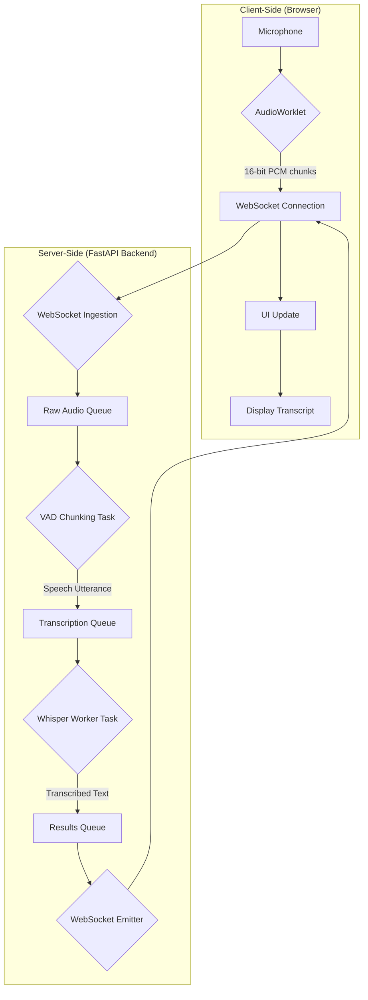
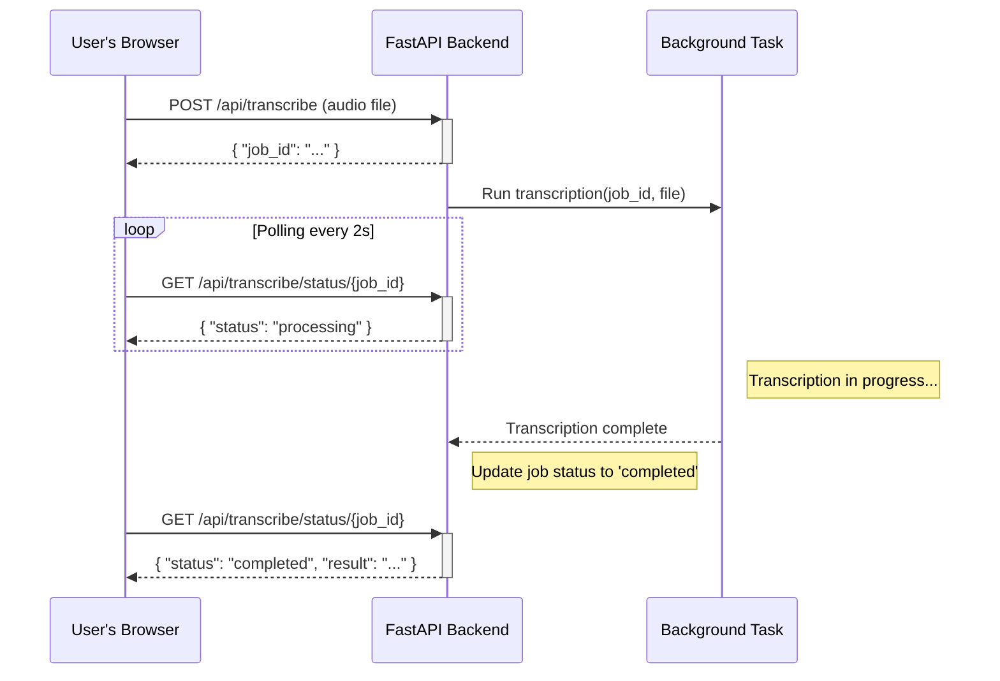

# ✍ EchoScribe

[]()
[](/LICENSE)

EchoScribe is a high-performance, self-hosted web application for both **real-time** and **batch** audio transcription. It leverages the power of `Faster-Whisper`, Silero VAD, and a modern web stack to provide a fast, accurate, and private transcription solution.

The interface allows you to select different Whisper models, choose your compute device (CPU or CUDA-enabled GPU), and fine-tune VAD parameters for optimal performance.

## 🎬 Demo
Here’s a quick look at how to use EchoScribe's real-time and batch transcription features.


## ✨ Features

-   **🎙️ Real-time Transcription:** Speak into your microphone and see the transcription appear live
-   **📂 Batch Processing:** Upload audio files and get the full transcription in the sidebar
-   **🚀 High Performance:** Uses `faster-whisper` for optimized CTranslate2-based inference
-   **🗣️ Voice Activity Detection (VAD):** Smartly chunks audio using Silero VAD to transcribe only when speech is detected, improving accuracy and reducing processing
-   **⚙️ Configurable:**
    -   Choose from various Whisper models (from `tiny` to `large-v3` and `distil-large-v3`)
    -   Select compute device (`CPU` or `CUDA`)
    -   Adjust VAD parameters like silence duration and speech probability threshold
    -   Configure API key authentication for secure access
    -   Set rate limiting for API endpoints and file uploads
    -   Customize session TTL and cleanup intervals
-   **🔒 Security Features:**
    -   Optional API key authentication with environment variable support
    -   Request rate limiting per IP address
    -   File validation and path traversal protection
    -   Secure constant-time string comparison for authentication
-   **💾 Download Recordings:** After a real-time session, download your recording as an MP3 file
-   **📝 Export Transcripts:** Easily copy the transcript or download it as a `.txt` file
-   **🌐 Modern UI:** Clean and intuitive interface built with Tailwind CSS
-   **🧪 Well-Tested:** Comprehensive test suite with 105+ tests covering all major functionality

## ⚡ How It Works

EchoScribe's architecture is designed for low-latency real-time processing. It uses a multi-stage, asynchronous pipeline on the backend.

### Real-time Transcription Flow

The real-time transcription process involves a continuous flow of data from the client's microphone to the server, through a processing pipeline, and back to the client's screen.



- **Client (Browser)**: The AudioWorklet captures audio from the microphone, downsamples it to 16kHz, and converts it to 16-bit PCM audio chunks.

- **WebSocket Connection**: These raw audio chunks are sent to the backend over a persistent WebSocket connection.

- **Backend Pipeline**:
    1. **Ingestion**: The server receives the audio chunks and places them into a raw audio queue.
    2. **VAD Chunking**: A dedicated task pulls from this queue and uses the Silero VAD model to detect speech. It buffers audio until it detects a pause (end of an utterance).
    3. **Transcription**: Once a complete utterance is buffered, it's sent to the transcription queue. A worker task picks it up and transcribes it using the selected faster-whisper model.
    4. **Emitter**: The resulting text is placed in a results queue. Another task sends this text back to the client over the same WebSocket.
    5. **UI Update**: The client receives the transcribed text and updates the user interface in real-time.

### Batch Transcription API Flow

The batch transcription process offloads the work to a background task, allowing you to upload large files without blocking the server. You can poll the status of the job to get the result when it's ready.



### API Endpoints
The application exposes several RESTful and WebSocket endpoints to power the frontend.
| Method | Path | Description |
| :--- | :--- | :--- |
| `GET` | `/` | Serves the main HTML frontend. |
| `GET` | `/api/config` | Provides available models, compute devices, and languages to the client. |
| `GET` | `/api/settings` | Retrieves the current VAD and application settings from `config.yaml`. |
| `POST` | `/api/settings` | Updates and saves new settings to `config.yaml`. |
| `POST` | `/api/transcribe` | Uploads an audio file for batch transcription. Returns a `job_id`. |
| `GET` | `/api/transcribe/status/{job_id}` | Polls the status and result of a batch transcription job. |
| `WEBSOCKET` | `/ws/{session_id}` | Establishes the real-time transcription WebSocket connection. |
| `GET` | `/download/{session_id}` | Downloads the complete audio recording of a real-time session as an MP3. |

## 🏁 Getting Started

### ⚠️ Important Compatibility Note
**Apple Silicon (M1/M2/M3) is NOT supported for GPU acceleration**.

The underlying library `CTranslate2` used by `faster-whisper` does not currently have optimized support for Apple's MPS backend. Attempting to use the `mps` device will result in errors/poor performance. **Mac users should select the `cpu` device**.

### 🎯 Prerequisites
- **Python**: Version 3.9+ is recommended.
- **Git**: To clone the repository.
- **FFmpeg**: This is a system dependency and must be installed separately.
    - **Ubuntu/Debian**: `sudo apt update && sudo apt install ffmpeg`
    - **macOS (with Homebrew)**: `brew install ffmpeg`
    - **Windows**: Download from the [official site](https://ffmpeg.org/download.html) and add the bin directory to your system's PATH.

### 🛠️ Installation
1. Clone the repository:

    ```sh
    git clone https://github.com/bhattaraiprayag/echoscribe.git
    cd echoscribe
    ```
2. Create and activate a virtual environment: 

    ```sh
    # Using venv
    python -m venv myenv
    source myenv/Scripts/activate   # On Windows
    source myenv/bin/activate       # On macOS/Linux

    # Using Conda
    conda create --name myenv python=3.10
    conda activate myenv
    ```

3. **Install PyTorch (Hardware-Specific)**:

    **For Windows/Linux with an NVIDIA GPU (Recommended)**:
    
    Install PyTorch with CUDA support. The version must be compatible with your NVIDIA driver. The command below is for CUDA 12.9. Check the PyTorch website for the correct command for your setup.
    ```sh
    pip3 install torch torchvision torchaudio --index-url https://download.pytorch.org/whl/cu129
    ```

    **For CPU-Only Systems (including macOS)**:
    
    Install the standard CPU version of PyTorch.
    ```sh
    pip3 install torch torchvision torchaudio
    ```

4. **Install project dependencies**:
    ```sh
    pip install -r requirements.txt
    ```

5. **Download the VAD model**:
    
    The Silero VAD model is required for real-time transcription. Run the following script to download it.

    ```sh
    python backend/get_vad.py
    ```
    
    This will download `silero_vad.onnx` into the current directory. The application expects it to be there.

## ▶️ Running the Application
1. **Navigate to the backend directory**:

    ```sh
    cd backend
    ```

2. **Start the server**:

- For development (with auto-reloading):

    ```sh
    uvicorn main:app --host 0.0.0.0 --port 8000 --reload
    ```
- For production:
    ```sh
    uvicorn main:app --host 0.0.0.0 --port 8000
    ```

3. **Open the web interface**:

    Open your browser and navigate to http://localhost:8000.

### 🧪 Running Tests

To ensure everything is working correctly, you can run the comprehensive test suite with 105+ tests:

```sh
# From the root directory
pytest tests/ -v                    # Run all tests with verbose output
pytest tests/test_pipeline.py      # Run specific test file
pytest -k "test_auth"               # Run tests matching pattern
```

**Test Coverage:**
- API endpoint testing
- Authentication and authorization
- Rate limiting and security
- File validation and sanitization
- Session and job cleanup
- Configuration management
- Model caching and concurrency
- Real-time transcription pipeline
- VAD chunking and batching

## 🔧 Configuration

You can adjust the default application behavior by editing the [backend/config.yaml](backend/config.yaml) file or using the `/api/settings` endpoint. This is particularly useful for fine-tuning the Voice Activity Detection (VAD) for your specific microphone or environment.

### Key Configuration Options

**VAD Parameters:**
- `prob_threshold` (0.1-0.9): Speech probability threshold (higher values are stricter, default: 0.8)
- `silence_duration` (0.1-5.0s): Seconds of silence to trigger end of utterance (default: 0.7)
- `min_speech_duration` (0.1-2.0s): Minimum speech segment length for transcription (default: 0.3)

**Audio Parameters:**
- `channels` (1-2): Number of audio channels (default: 1)
- `sample_rate` (8000-48000Hz): Audio sample rate (default: 16000)
- `sample_width` (1-4 bytes): Bytes per sample (default: 2)

**Transcription Parameters:**
- `context_max_length` (0-500): Maximum context length for Whisper to maintain continuity (default: 224)

**Cleanup Parameters:**
- `session_ttl_minutes` (1-1440): Session time-to-live in minutes (default: 60)
- `job_retention_minutes` (1-1440): Completed job retention time (default: 120)
- `cleanup_interval_seconds` (60-3600): Cleanup task interval (default: 300)

**Authentication (Optional):**
- `enabled` (true/false): Enable API key authentication (default: false)
- `api_key`: Your API key (can be overridden with `ECHOSCRIBE_API_KEY` environment variable)

**Rate Limiting:**
- `enabled` (true/false): Enable rate limiting (default: true)
- `requests_per_minute`: API requests per IP per minute (default: 100)
- `uploads_per_minute`: File uploads per IP per minute (default: 10)

## 🔒 Security

EchoScribe includes several security features:

- **API Key Authentication**: Optional authentication via `X-API-Key` header with environment variable support
- **Rate Limiting**: Configurable per-IP rate limiting for API endpoints and file uploads
- **Input Validation**: Comprehensive validation for file uploads and settings updates
- **Path Traversal Protection**: Filename sanitization to prevent directory traversal attacks
- **Secure Comparisons**: Constant-time string comparison for API keys to prevent timing attacks

To enable authentication, set `auth.enabled: true` in `config.yaml` and provide an API key either in the config file or via the `ECHOSCRIBE_API_KEY` environment variable.

## 🏗️ Architecture

**Code Quality:**
- PEP8 compliant codebase
- Type annotations throughout
- Comprehensive docstrings
- 105+ automated tests
- Double-check locking for model caching
- Async/await for non-blocking I/O

**Pipeline Architecture:**
- Multi-stage async pipeline for real-time processing
- Queue-based communication between stages
- VAD-based intelligent audio chunking
- Transcription context management for accuracy
- Graceful shutdown handling

## 🤝 Contributing

Contributions are welcome! Please feel free to submit a pull request or open an issue.

1. Fork the repository
2. Create your feature branch (`git checkout -b feature/amazing-feature`)
3. Run tests (`pytest tests/ -v`)
4. Commit your changes (`git commit -m 'Add amazing feature'`)
5. Push to the branch (`git push origin feature/amazing-feature`)
6. Open a Pull Request

## 📜 License

This project is licensed under the MIT License - see the [LICENSE](LICENSE) file for details.