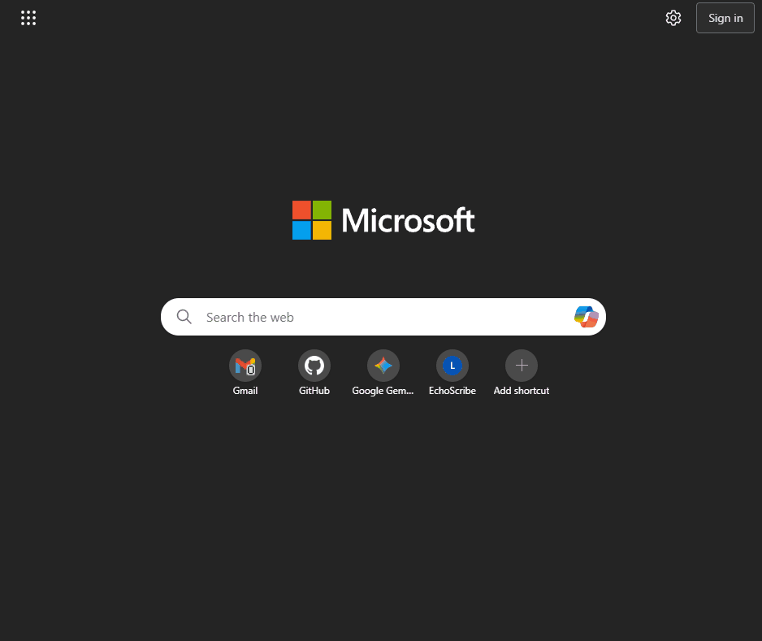
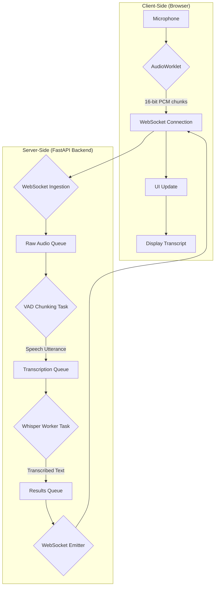
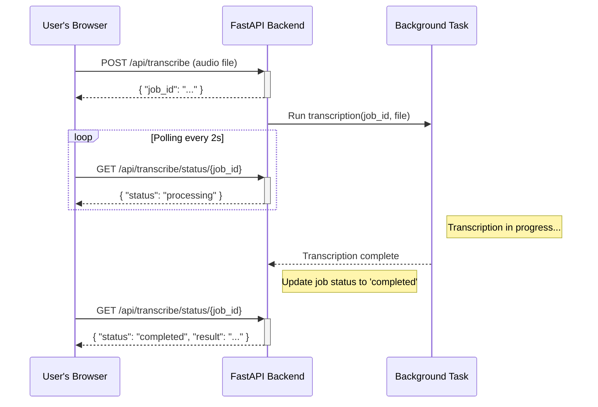

# ✍ EchoScribe

[]()
[](/LICENSE)

EchoScribe is a high-performance, self-hosted web application for both **real-time** and **batch** audio transcription. It leverages the power of `Faster-Whisper`, Silero VAD, and a modern web stack to provide a fast, accurate, and private transcription solution.

The interface allows you to select different Whisper models, choose your compute device (CPU or CUDA-enabled GPU), and fine-tune VAD parameters for optimal performance.

## 🎬 Demo

Here’s a quick look at how to use EchoScribe's real-time and batch transcription features.



## ✨ Features

- **🎙️ Real-time Transcription:** Speak into your microphone and see the transcription appear live
- **📂 Batch Processing:** Upload audio files and get the full transcription in the sidebar
- **🚀 High Performance:** Uses `faster-whisper` for optimized CTranslate2-based inference
- **🗣️ Voice Activity Detection (VAD):** Smartly chunks audio using Silero VAD to transcribe only when speech is detected, improving accuracy and reducing processing
- **⚙️ Configurable:**
  - Choose from various Whisper models (from `tiny` to `large-v3` and `distil-large-v3`)
  - Select compute device (`CPU` or `CUDA`)
  - Adjust VAD parameters like silence duration and speech probability threshold
  - Configure API key authentication for secure access
  - Set rate limiting for API endpoints and file uploads
  - Customize session TTL and cleanup intervals
- **🔒 Security Features:**
  - Optional API key authentication with environment variable support
  - Configurable rate limiting for API, uploads, and WebSocket connections
  - Trusted-proxy aware client IP resolution
  - Redacted settings responses and one-time WebSocket auth tokens
  - File validation and path traversal protection
  - Secure constant-time string comparison for authentication
- **💾 Download Recordings:** After a real-time session, download your recording as an MP3 file
- **📝 Export Transcripts:** Easily copy the transcript or download it as a `.txt` file
- **🌐 Modern UI:** Clean and intuitive interface built with Tailwind CSS
- **🧪 Well-Tested:** Comprehensive test suite with 170+ tests covering core runtime and security paths

## ⚡ How It Works

EchoScribe's architecture is designed for low-latency real-time processing. It uses a multi-stage, asynchronous pipeline on the backend.

### Real-time Transcription Flow

The real-time transcription process involves a continuous flow of data from the client's microphone to the server, through a processing pipeline, and back to the client's screen.


```mermaid
graph TD
    subgraph "Client-Side (Browser)"
        A[Microphone] --> B{AudioWorklet}
        B --> |16-bit PCM chunks| C[WebSocket Connection]
        C --> K[UI Update]
        K --> L[Display Transcript]
    end

    subgraph "Server-Side (FastAPI Backend)"
        C --> D{WebSocket Ingestion}
        D --> E[Raw Audio Queue]
        E --> F{VAD Chunking Task}
        F -- Speech Utterance --> G[Transcription Queue]
        G --> H{Whisper Worker Task}
        H -- Transcribed Text --> I[Results Queue]
        I --> J{WebSocket Emitter}
        J --> C
    end
```

- **Client (Browser)**: The AudioWorklet captures audio from the microphone, downsamples it to 16kHz, and converts it to 16-bit PCM audio chunks.

- **WebSocket Connection**: These raw audio chunks are sent to the backend over a persistent WebSocket connection.

- **Backend Pipeline**:
  1. **Ingestion**: The server receives the audio chunks and places them into a raw audio queue.
  2. **VAD Chunking**: A dedicated task pulls from this queue and uses the Silero VAD model to detect speech. It buffers audio until it detects a pause (end of an utterance).
  3. **Transcription**: Once a complete utterance is buffered, it's sent to the transcription queue. A worker task picks it up and transcribes it using the selected faster-whisper model.
  4. **Emitter**: The resulting text is placed in a results queue. Another task sends this text back to the client over the same WebSocket.
  5. **UI Update**: The client receives the transcribed text and updates the user interface in real-time.

### Batch Transcription API Flow

The batch transcription process offloads the work to a background task, allowing you to upload large files without blocking the server. You can poll the status of the job to get the result when it's ready.


```mermaid
sequenceDiagram
    participant User as User's Browser
    participant API as FastAPI Backend
    participant Worker as Background Task

    User->>+API: POST /api/transcribe (audio file)
    API-->>-User: { "job_id": "..." }
    API->>Worker: Run transcription(job_id, file)

    loop Polling every 2s
        User->>+API: GET /api/transcribe/status/{job_id}
        API-->>-User: { "status": "processing" }
    end

    Note right of Worker: Transcription in progress...

    Worker-->>API: Transcription complete
    Note right of API: Update job status to 'completed'

    User->>+API: GET /api/transcribe/status/{job_id}
    API-->>-User: { "status": "completed", "result": "..." }
```

### API Endpoints

The application exposes several RESTful and WebSocket endpoints to power the frontend.
| Method | Path | Description |
| :--- | :--- | :--- |
| `GET` | `/` | Serves the main HTML frontend. |
| `GET` | `/api/config` | Provides available models, compute devices, and languages to the client. |
| `GET` | `/api/settings` | Retrieves settings from `config.yaml` (API key redacted; authenticated when auth is enabled). |
| `POST` | `/api/settings` | Updates and saves new settings to `config.yaml`. |
| `POST` | `/api/ws-auth-token` | Issues a short-lived WebSocket auth token (requires `X-API-Key` when auth is enabled). |
| `POST` | `/api/transcribe` | Uploads an audio file for batch transcription. Returns a `job_id`. |
| `GET` | `/api/transcribe/status/{job_id}` | Polls the status and result of a batch transcription job. |
| `DELETE` | `/api/transcribe/{job_id}` | Cancels a pending or running batch transcription job. |
| `GET` | `/api/model/status` | Returns cache and download status for a specific model. |
| `WEBSOCKET` | `/ws/{session_id}` | Real-time connection; first config message must include `auth_token` from `/api/ws-auth-token`. |
| `GET` | `/download/{session_id}` | Downloads the complete audio recording of a real-time session as an MP3. |

## 🏁 Getting Started

### ⚠️ Important Compatibility Note

**Apple Silicon (M1/M2/M3) is NOT supported for GPU acceleration**.
Mac users should select the `cpu` device. The application will default to CPU on macOS.

### 🎯 Prerequisites

- **Python**: Version 3.11+ is recommended.
- **Git**: To clone the repository.
- **uv**: A fast Python package installer and resolver. [Install uv](https://docs.astral.sh/uv/getting-started/installation/).
- **FFmpeg**: This is a system dependency and must be installed separately.
  - **Ubuntu/Debian**: `sudo apt update && sudo apt install ffmpeg`
  - **macOS (with Homebrew)**: `brew install ffmpeg`
  - **Windows**: Download from the [official site](https://ffmpeg.org/download.html) and add the bin directory to your system's PATH.

### 🛠️ Installation

1. **Clone the repository**:

   ```sh
   git clone https://github.com/bhattaraiprayag/echoscribe.git
   cd echoscribe
   ```

2. **Sync dependencies**:
   EchoScribe uses `uv` for dependency management. This command creates a virtual environment and installs all dependencies (including hardware-optimized PyTorch versions).

   ```sh
   uv sync
   ```

3. **Download the VAD model**:
   The Silero VAD model is loaded through the pinned `silero-vad` package (no runtime `torch.hub` master-zip fetch).
   ```sh
   uv run python backend/get_vad.py
   ```

## ▶️ Running the Application

1. **Start the server**:

   - For development (with auto-reloading):
     ```sh
     uv run uvicorn backend.main:app --host 0.0.0.0 --port 8000 --reload
     ```
   - For production:
     ```sh
     uv run uvicorn backend.main:app --host 0.0.0.0 --port 8000
     ```

2. **Open the web interface**:
   Open your browser and navigate to [http://localhost:8000](http://localhost:8000).

### 🐳 Docker Deployment

EchoScribe can be deployed using Docker for easier setup and isolation.

#### Prerequisites

- **Docker**: Version 20.10+ recommended
- **Docker Compose**: Version 2.0+ recommended
- **NVIDIA Container Toolkit** (optional): Required for GPU acceleration in Docker

#### Quick Start with Docker Compose

1. **Clone and navigate to the repository**:

   ```sh
   git clone https://github.com/bhattaraiprayag/echoscribe.git
   cd echoscribe
   ```

2. **Start the application**:

   ```sh
   docker-compose up -d
   ```

3. **Access the application**:
   Open your browser and navigate to http://localhost:8000.

4. **View logs**:

   ```sh
   docker-compose logs -f
   ```

5. **Stop the application**:
   ```sh
   docker-compose down
   ```

#### GPU Support (NVIDIA)

To enable GPU acceleration in Docker:

1. **Install NVIDIA Container Toolkit**:

   ```sh
   # Ubuntu/Debian
   distribution=$(. /etc/os-release;echo $ID$VERSION_ID)
   curl -s -L https://nvidia.github.io/nvidia-docker/gpgkey | sudo apt-key add -
   curl -s -L https://nvidia.github.io/nvidia-docker/$distribution/nvidia-docker.list | sudo tee /etc/apt/sources.list.d/nvidia-docker.list
   sudo apt-get update && sudo apt-get install -y nvidia-container-toolkit
   sudo systemctl restart docker
   ```

2. **Modify `docker-compose.yml`** to enable GPU:

   ```yaml
   services:
     echoscribe:
       # ... existing config ...
       deploy:
         resources:
           reservations:
             devices:
               - driver: nvidia
                 count: 1
                 capabilities: [gpu]
   ```

3. **Verify GPU access**:
   ```sh
   docker-compose exec echoscribe nvidia-smi
   ```

#### Environment Variables

Configure the application using environment variables:

| Variable             | Description                                   | Default          |
| :------------------- | :-------------------------------------------- | :--------------- |
| `ECHOSCRIBE_API_KEY` | API key for authentication (overrides config) | (empty)          |
| `MODELS_CACHE_DIR`   | Directory for model cache                     | `./models_cache` |

Example:

```sh
ECHOSCRIBE_API_KEY=your-secret-key docker-compose up -d
```

#### Persistent Storage

The Docker setup uses volumes for persistent storage:

- `models_cache`: Stores downloaded Whisper models (prevents re-download)

On container startup, the entrypoint ensures the mounted `models_cache` directory is
owned by the non-root application user so Docker bind mounts do not block model
downloads or cache repair.

The `make docker-run` target reuses the same tagged image as `make docker-build`
(`echoscribe:test` by default) before starting the Compose stack.

### 🧪 Running Tests

To ensure everything is working correctly, run the test and quality checks from the repository root:

```sh
make sync                                 # Install dependencies
make lint                                 # Ruff lint checks
make format-check                         # Formatting gate
make pre-commit                           # Run all hooks
make test                                 # Full pytest suite
make coverage                             # Coverage report + fail-under gate
make smoke                                # Startup smoke test (backend.main:app)
make docker-build                         # Docker image build verification
make docker-run                           # Build and start the Docker stack
make docker-up                            # Alias for docker-run
make clean                                # Safely remove pycache/test/build artifacts
```

**Test Coverage:**

- API endpoint testing
- Authentication and authorization
- Rate limiting and security
- File validation and sanitization
- Session and job cleanup
- Configuration management
- Model caching and concurrency
- Real-time transcription pipeline
- VAD chunking and batching

## 🔧 Configuration

You can adjust the default application behavior by editing the [backend/config.yaml](backend/config.yaml) file or using the `/api/settings` endpoint. This is particularly useful for fine-tuning the Voice Activity Detection (VAD) for your specific microphone or environment.

### Key Configuration Options

**VAD Parameters:**

- `prob_threshold` (0.1-0.9): Speech probability threshold (higher values are stricter, default: 0.6)
- `silence_duration` (0.1-5.0s): Seconds of silence to trigger end of utterance (default: 0.7)
- `min_speech_duration` (0.1-2.0s): Minimum speech segment length for transcription (default: 0.3)

**Audio Parameters:**

- `channels` (1-2): Number of audio channels (default: 1)
- `sample_rate` (8000-48000Hz): Audio sample rate (default: 16000)
- `sample_width` (1-4 bytes): Bytes per sample (default: 2)

**Transcription Parameters:**

- `context_max_length` (0-500): Maximum context length for Whisper to maintain continuity (default: 224)

**Cleanup Parameters:**

- `session_ttl_minutes` (1-1440): Session time-to-live in minutes (default: 60)
- `job_retention_minutes` (1-1440): Completed job retention time (default: 120)
- `cleanup_interval_seconds` (60-3600): Cleanup task interval (default: 300)

**Authentication (Optional):**

- `enabled` (true/false): Enable API key authentication (default: false)
- `api_key`: Your API key (can be overridden with `ECHOSCRIBE_API_KEY` environment variable)

**Rate Limiting:**

- `enabled` (true/false): Enable rate limiting (default: true)
- `requests_per_minute`: API requests per IP per minute (default: 100)
- `uploads_per_minute`: File uploads per IP per minute (default: 10)
- `websocket_connections_per_ip`: Concurrent WebSocket sessions per client IP (default: 5)
- `trusted_proxies`: CIDRs/IPs allowed to supply `X-Forwarded-For` (default: `[]`)

**Upload Parameters:**

- `max_file_size_mb`: Maximum accepted upload size in megabytes (default: 100)

## 🔒 Security

EchoScribe includes several security features:

- **API Key Authentication**: Optional authentication via `X-API-Key` header with environment variable support
- **Rate Limiting**: Configurable per-IP limits for API endpoints, uploads, and WebSockets
- **Trusted Proxy Enforcement**: `X-Forwarded-For` is honored only for configured proxy CIDRs
- **Secrets Hygiene**: `/api/settings` redacts `auth.api_key` in responses
- **WebSocket Hardening**: One-time, short-lived auth tokens replace query-string API keys
- **Input Validation**: Comprehensive validation for file uploads and settings updates
- **Path Traversal Protection**: Filename sanitization to prevent directory traversal attacks
- **Secure Comparisons**: Constant-time string comparison for API keys to prevent timing attacks

To enable authentication, set `auth.enabled: true` in `config.yaml` and provide an API key either in the config file or via the `ECHOSCRIBE_API_KEY` environment variable.

## 🏗️ Architecture

**Code Quality:**

- PEP8 compliant codebase
- Type annotations throughout
- Comprehensive docstrings
- 170+ automated tests
- Double-check locking for model caching
- Async/await for non-blocking I/O

**Pipeline Architecture:**

- Multi-stage async pipeline for real-time processing
- Queue-based communication between stages
- VAD-based intelligent audio chunking
- Transcription context management for accuracy
- Graceful shutdown handling

## 🤝 Contributing

Contributions are welcome! Please read our [CONTRIBUTING.md](CONTRIBUTING.md) for details on our code of conduct, and the process for submitting pull requests having strictly followed our DevOps hygiene and quality standards.

## 📜 License

This project is licensed under the MIT License - see the [LICENSE](LICENSE) file for details.
